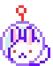

[//]: # (Title.)
<h1>
  
 
   
  Hello & Welcome! 
   
</h1>

[//]: # (Markdown buttons!)

 
  
  
  
  
  
  
  
 

[//]: # (Description.)

 
  ── .✦  ✦. ──   
  My name is Chandler and I'm a gameplay programmer!  
  I'm an undergraduate at UCF working on a game design B.A. and a CS minor.  
  I love cats, horror, psychology, and detective fiction.
 

[//]: # (Links.)

 
  Check out my games on <a href="https://ninthewanderer.itch.io">itch.io</a>!  
  A summary of my projects and experience can be found in my <a href="https://ninthewanderer.wixsite.com/portfolio">portfolio</a>.  
  Feel free to connect on <a href="https://www.linkedin.com/in/chandlerguzman">LinkedIn</a>.   
  ── .✦  ✦. ──

